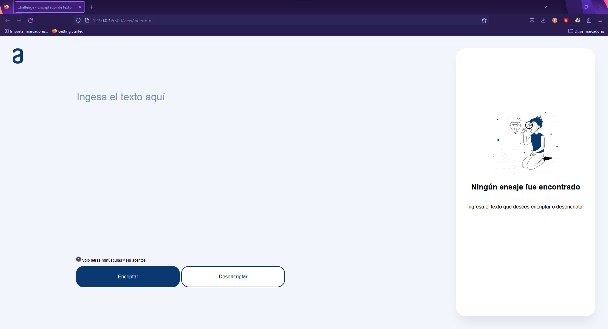

# Challenge 1 - Encriptador de texto

## Indice

- [¿Qué es?](#¿qué-es)
- [Funcionamiento](#funcionamiento)
- [Características](#características)
- [Documentación](#documentación)
- [Imáganes](#imágenes)

## ¿Qué es?

Siendo el primer desadío puesto por [Alura](https://www.aluracursos.com/) como parte programa Oracle ONE, este challenge es un encriptador y desencriptador de texto.

## Funcionamiento

El encriptador cambia las vocales por una cadena en especifico, el desencriptador cambia dichas cadenas por la vocal correspondiente.

| Vocal | Cadena |
|-|-|
| a | enter |
| e | imes |
| i | ai |
| o | ober |
| u | ufat |

De manera aque un texto que el texto:

> hola a todos

Quedaría:

> hoberlenter enter toberdobers

## Características

- Funciona con letras mayúsculas y minusculas sin acentos
- Encripta y descencripta (ver arriba)
- Puede copiar al porta papeles
- Diseño responsivo

## Documentación

## Imágenes

### Pantalla de escritorio

